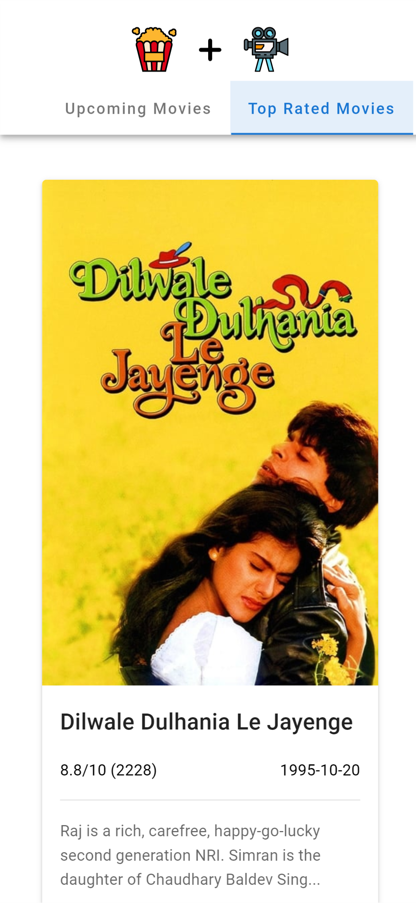

# filmsapp

## URL
[APP-URL][http://film-app.s3-website.ap-south-1.amazonaws.com/]

## Images



## Project setup
```
yarn install
```

### Compiles and hot-reloads for development
```
yarn serve
```

### Compiles and minifies for production
```
yarn build
```

### Lints and fixes files
```
yarn lint
```

### Customize configuration
See [Configuration Reference][configuration-reference].
